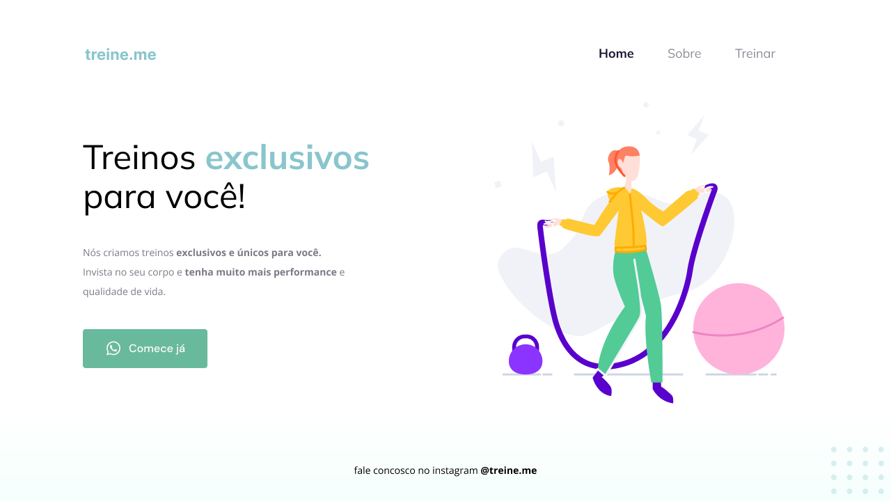

<h1 align="center"> Stage02-Projeto02   Treine.me </h1>

  <a href="#-tecnologias">Tecnologias</a>&nbsp;&nbsp;&nbsp;|&nbsp;&nbsp;&nbsp;
  <a href="#-projeto">Projeto</a>&nbsp;&nbsp;&nbsp;|&nbsp;&nbsp;&nbsp;
  <a href="#-layout">Layout</a>&nbsp;&nbsp;&nbsp;|&nbsp;&nbsp;&nbsp;
  <a href="#memo-licença">Licença</a>

  

 

  

## 🚀 Tecnologias

Esse projeto foi desenvolvido com as seguintes tecnologias:

- HTML  
- CSS
- Git
- Github
- Figma

## 💻 Projeto

O Projeto 02 é uma criação de uma Landing-Page básica para fotalecer nosso conhecimento sobre alguns conceitos aprendidos em aula na Rocketseat, entre eles:

<ul>
  <li>Estruturando um projeto HTML</li>
  <li>Uso de tags semânticas HTML </li>
  <li>Conceito box model, flexbox CSS</li>
  <li>Posicionamento e alinhamento de elementos na tela</li>
  <li>Aplicando fontes customizadas</li>
  <li>Espaçamentos</li>
  <li>Ferramenta de desenvolvimento DevTools</li>
  <li>Acessibilidade e refatoração</li>
</ul>

 

- [Visite o projeto online](https://iaramarques.github.io/Stage02-Projeto02-Treine.me/)

 

## 🔖 Layout

Você pode visualizar o layout do projeto através [DESSE LINK](https://www.figma.com/file/rkDOHGPwwFtBNqEdHSuQPd/Projeto-02---Explorer?t=QVJeKM91CpwU4oy7-0). É necessário ter conta no [Figma](https://figma.com) para acessá-lo.

  

## :memo: Licença

Esse projeto está sob a licença MIT.

---

Feito com ♥ by Iara Marques :wave: [Participe da comunidade da RocketSeat!](https://discord.gg/rocketseat)